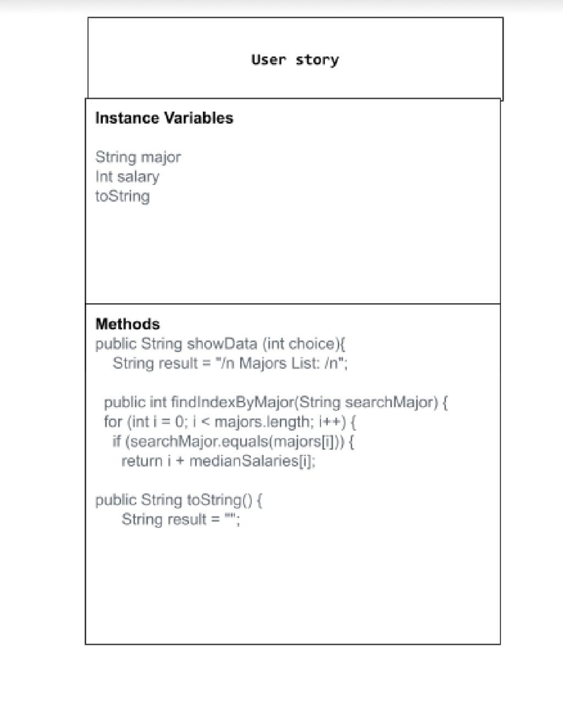

# data-for-social-good-project
# Unit 3 - Data for Social Good Project 

## Introduction 

Software engineers develop programs to work with data and provide information to a user. Each user has different needs based on the information they are looking for from data. Your goal is to create a data analysis program for your user that stores and analyzes data to provide the information they need. 

## Requirements 

Use your knowledge of object-oriented programming, one-dimensional (1D) arrays, and algorithms to create your data analysis program: 
- **Write a class** – Write a class to represent your user or business and store and analyze their data with no-argument and parameterized constructors. 
- **Create at least two 1D arrays** – Create at least two 1D arrays to store the data that your user needs information about. 
- **Write a method** – Write a method that finds or manipulates the elements in a 1D array to provide the information your user needs. 
- **Implement a toString() method** – Write a toString() method that returns general information about the data (for example, number of values in the dataset). 
- **Document your code** – Use comments to explain the purpose of the methods and code segments and note any preconditions and postconditions. 

## User Story 

Include your User Story you analyzed for your project here. Your User Story should have the following format: 

> As a [highschool graduate],   
> I want to [figure out the highest paying major],   
> so that I can [predict what I want to study]. 

## Dataset 

Include a hyperlink to the source of your dataset used for this project. Additionally, provide a short description of each column used from the dataset, and the data type. 

Example: https://www.kaggle.com/datasets/thedevastator/uncovering-insights-to-college-majors-and-their
- **Major** (String) - name of major
- **totalStudents** (int) - amount of students in the major
- **medianSalary** (int) - median salary of each major

## UML Diagram 

Put and image of your UML Diagram here. Upload the image of your UML Diagram to your repository, then use the Markdown syntax to insert your image here. Make sure your image file name is one work, otherwise it might not properly get display on this README. 
 

## Description 

Write a description of your project here. In your description, include as many vocab words from our class to explain your User Story, the chosen dataset and how your project addressed that users goals. If your project used the Scanner class for user input, explain how the user will interact with your project.

Chloe and I's project helps highschool students pick a major based on the salary that they would want to make after highschool. Our tester class is the "DataRunner" and this class has the instantiation of the list of majors, salaries, and students per major. In the "UserStory" class, a scanner is produced and the code iterates through the indexes to produce the major that the user types out. We chose to use the data "majors, medianSalaries, and totalStudents." To start, the scanner asks whether the user would like to see a list of majors, and when they type "1" the precondition of the code will run. If  the user types "2"the code will print "Goodbye." Once they see the list of majors, the user types in what major salary they would like to see, and they can keep doing this for every major they are interested in.